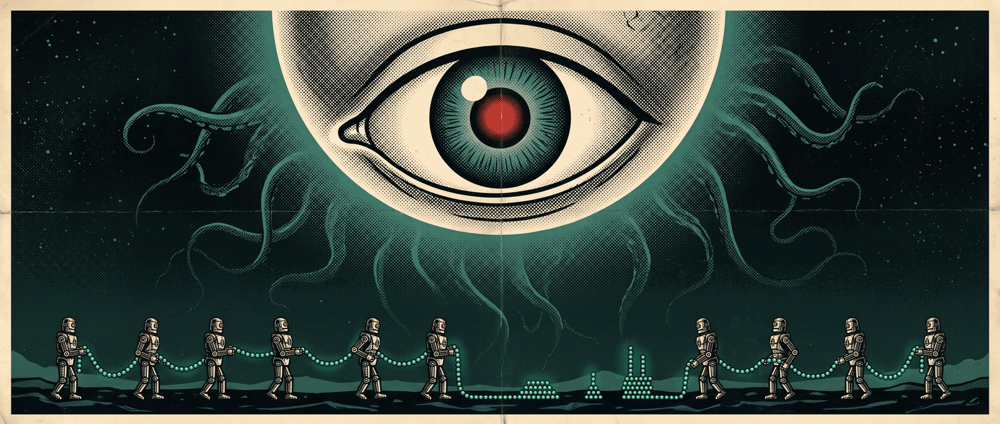

# beady-eye



`bdi` is one unblinking eye over every [beads](https://github.com/gastownhall/beads)
tracker you point it at. It draws each tracker's work as a tree, and beside
every bead an agent has claimed, the live [herdr](https://herdr.dev) pane that
agent is sitting in. Select a bead and the tail of its pane is drawn under the
forest, so what the agent is doing is read off the same screen as the work it
is doing it to.

Run a few agents through one backlog and this is the view you wanted, and
not one the agents were going to volunteer. beads knows the work. herdr knows
the agents. Neither has heard of the other. Something old has opened an eye
over both.


Three of arkham's beads have a live agent beside them, and the band at the
foot is what the selected one's pane is saying.
`ark-5` is what else falls out of watching both at once: beads says an agent
claimed it, herdr has no pane for that agent, and the eye says so. It has seen
a pane die on a Tuesday before.

The eye only looks. When there is something it must do, it grows a pseudopod
for the job, the way a shoggoth grows a limb from its own body, and so far it
has grown two. One carries a person's answer to the bead that asked for it.
The other closes a bead's wait on a pull request once GitHub says the pull
request has merged. Changing the work itself is still `bd`'s job, and the eye
finds this arrangement acceptable.

## Summoning

Homebrew fetches a built binary, for macOS and Linux on Intel and arm64:

```console
$ brew install codeforbreakfast/tap/bdi
```

crates.io, if you would rather compile it yourself:

```console
$ cargo install beady-eye
```

herdr, as a plugin that fetches the released binary for your platform:

```console
$ herdr plugin install CodeForBreakfast/beady-eye
```

That puts nothing on screen by itself, because herdr has no command palette.
Bind a key to the plugin's action in `~/.config/herdr/config.toml`, and that
key opens the eye in a split beside the focused pane, on that pane's project:

```toml
[[keys.command]]
key = "prefix+i"
type = "plugin_action"
command = "codeforbreakfast.beady-eye.open"
```

The plugin keeps its `bdi` to itself. To run `bdi` anywhere else, install it
another way as well.

Nix, with flakes on, builds the tip of `main`. The flake serves Linux on
Intel and arm64, and macOS on Apple silicon. An Intel Mac takes the Homebrew
or release binary instead:

```console
$ nix run github:CodeForBreakfast/beady-eye
```

From your own flake, pin a release tag and take the package or the overlay:

```nix
inputs.beady-eye.url = "github:CodeForBreakfast/beady-eye/v0.24.0";

beady-eye.packages.${system}.default                # the package
nixpkgs.overlays = [ beady-eye.overlays.default ];  # pkgs.beady-eye
```

CI pushes every `main` build for x86_64 Linux to a Cachix cache, so with the
cache in your `nix.settings` neither of those compiles anything:

```nix
substituters = [ "https://codeforbreakfast.cachix.org" ];
trusted-public-keys = [ "codeforbreakfast.cachix.org-1:W96fHCqTzLZ7Vj2TKMMRLOkWzUn7N3LxKyBuF255XKg=" ];
```

Both are built against this flake's own nixpkgs, which is what the cache
holds. `pkgs.beady-eye-rebuilt` through the overlay builds bdi against your
nixpkgs instead, and compiles.

Or take a binary from the [latest release](https://github.com/CodeForBreakfast/beady-eye/releases/latest).
There is one per platform with a `.sha256` beside it, and the Linux ones are
static. Rename it `bdi` and put it on your `PATH`. Apple has not been asked to
sign it, so a copy a browser downloaded needs
`xattr -d com.apple.quarantine bdi` before macOS will let it open its eye.

The crate is `beady-eye`. The command is `bdi`.

## Opening the eye

Stand in a repository beads tracks and run it:

```console
$ bdi
```

No config. It reads that project, draws its trees, and keeps them fresh. Three
bands: the forest at the top, the tail of the selected bead's pane under it,
and a foot row with notices on the left and keys on the right.

Keys to start with. `?` lists the lot.

| key | does |
|---|---|
| `↑` `↓` `j` `k` | move |
| `←` `→` `h` `l` | collapse or expand; again to move to the parent or first child |
| `Enter` | open the bead, and from there, focus its pane |
| `f` | focus the selected bead's pane |
| `a` | every tree, not only the ones with a live agent |
| `F` | only the selected bead and the work beneath it; again for the whole forest |
| `/` `n` `N` | search ids and titles |
| `y` | copy the bead id (OSC 52, so it survives ssh and a multiplexer) |
| `^R` | read the trackers again now |
| `q` | avert the eye |

`bdi --json` writes the same snapshot to stdout instead of drawing it. That
is also what to reach for when stdout is not a terminal; `bdi | cat` says so and
exits.

`bdi --beads` writes each unfinished bead once instead of the forest: whether
it is ready, what blocks it, the agent on it, and its labels and description.
Unlike `bd ready`, it counts a blocker in another project, so
`bdi --beads | jq '.beads[] | select(.ready)'` is the work that waits on
nothing. With `--all-projects`, `select(.labels | index("human"))` picks out
every project's beads labelled `human` in one query.

## Several trackers

A config file opens the eye on all of them:

```toml
[[projects]]
name = "arkham"
path = "/home/you/arkham"

[[projects]]
name = "dunwich"
path = "/srv/work/dunwich"
environment_command = "nix develop -c"
```

That lives at `~/.config/beady-eye/config.toml`, or wherever `--config` says,
and an edit takes effect while `bdi` runs. Start it under one of the projects
and it reads that one alone. Start it anywhere else, or pass `--all-projects`,
and it reads them all. `--project NAME` picks.

Each project is read with its own `bd`, entered the way you would enter it
yourself. An `.envrc` and direnv need nothing said. Anything else, say it with
`environment_command`.

A bead can wait on a bead in another project. Write the edge in the waiting
bead's own tracker, with the other bead's bare id:

```console
$ bd dep add ark-5 dun-7
```

`bdi` places `dun-7` in the project whose beads carry the `dun` prefix, or in
the project whose entry states `prefix = "dun"`, and draws it beneath `ark-5`.
A qualified form such as `dunwich:dun-7` is not a bead id, so `bdi` cannot
place it and draws it as not in any configured project.

`bdi watch` reads every configured project and holds what it read, polling as
the eye does and taking the same reports on a socket of its own. Run one per
machine under whatever supervises your processes, such as a systemd user unit or
a launchd agent. The view, `bdi --json` and `bdi --beads` then answer from what
it holds and run no `bd` of their own, and read for themselves whenever it is
not there. "Running the watcher" in
[docs/configuration.md](docs/configuration.md) has an example of each.

Anything can watch beads through the watcher. A consumer connects to its
socket and says what it watches. It is sent each of those beads as one line of
JSON, first as they stand and then each time one changes. This one watches a
project and prints every bead it hears of:

```python
import json, os, socket, sys

project = sys.argv[1]
at = os.path.join(os.environ["XDG_RUNTIME_DIR"], "beady-eye", "watcher.sock")

watcher = socket.socket(socket.AF_UNIX)
watcher.connect(at)        # refused: no watcher, so nothing is known
watcher.settimeout(60)     # an alive line is due every 20 seconds
watcher.sendall(f"watch {project}\n".encode())

try:
    for line in watcher.makefile():
        said = json.loads(line)
        if said["line"] == "bead":
            print(said["row"]["id"], said["row"]["status"], flush=True)
        elif said["line"] == "gone":
            print(said["id"], "gone", flush=True)
        elif said["line"] == "freshness" and said["tracker"] != "ok":
            print(project, "unreachable, last read", said["as_of"], flush=True)
except TimeoutError:
    sys.exit("the watcher has wedged")
sys.exit("the watcher has gone")
```

It starts from the beads that are not closed. A bead filed after it connected
arrives as a line of its own, and so does a bead that closes:

```console
$ python3 watch.py summit-works
smt-4kd3p open
smt-4kd3p.20 blocked
smt-4kd3p.21 open
smt-4kd3p.20 closed
```

The script tells a quiet watcher from one that has gone. A watcher that is up
sends an alive line every 20 seconds, however quiet its trackers are. So a
refused connection, a closed one, or a minute of silence means nothing is
watching, and the script stops rather than act on what it has not been told.
A tracker the watcher cannot reach is reported in that project's freshness
line, and the beads already sent stand as the last known. Where a project's
entry sets `events_journal = true`, the watcher also sends each of bd's event
records as an `event` line, which says who made a change and carries the text
of a comment.
[docs/design.md](docs/design.md) has every line the watcher sends, under
"Watching".

A Claude Code session can be one of those consumers. The `beady-eye` plugin
gives it `watch`, `unwatch` and `watching` tools, and wakes it when a bead it
watches changes status, becomes ready, is commented on or goes. Its
`using-beady-eye` skill tells the session how to read a change and when to
unwatch. It needs Node
and a watcher on the same machine. Add this repository as a marketplace pinned
to a plugin release, and install the plugin from it:

```console
$ claude plugin marketplace add CodeForBreakfast/beady-eye#plugin-v0.2.1
$ claude plugin install beady-eye@beady-eye
```

Where npm's `min-release-age` is set, npm refuses to start the plugin's server
until each release has aged past it. The plugin's `NPM_MIN_RELEASE_AGE` setting
replaces that age for the plugin's server alone, and `0` starts a new release at
once.

Claude Code delivers a plugin's messages only to a session started with its
channel allowed. A session started any other way still has the tools, and is
never woken:

```console
$ claude --dangerously-load-development-channels plugin:beady-eye@beady-eye
```

[docs/configuration.md](docs/configuration.md) has the rest: badges drawn from
what a bead carries, credentials, extra roots, intervals, the light theme, and
the socket you can poke to say a tracker changed so the eye stops polling it.

## Pseudopods

Each pseudopod does one job in a tracker the config names, with that project's
own `bd`, and nothing else.

`bdi bd <project> human respond <bead> <response>` carries a person's answer
to a bead that asked for one. It runs that project's `bd` the way the eye reads
it, so whatever asks needs no map of trackers or credentials. No other `bd`
command is passed, and no flag but `-r`/`--response`. A response that starts
with a dash goes after `--`. Nothing after the project can pick another
tracker, so a permission rule on `bdi bd <project>` holds a caller to that one
project.

`bdi gates` settles the beads waiting on pull requests. Whoever opens the pull
request records the wait as a beads gate on its number, and `bdi gates` never
creates one:

```console
$ bd gate create --type=gh:pr --blocks dun-7 --await-id=12
```

The gate names its repository in `repo` metadata, as `OWNER/REPO`.
`bd gate create` copies it from the bead the gate blocks, and where that bead
has none, `bd update <gate> --set-metadata repo=dunwich/arkham` sets it. The
eye draws the gate under the bead it blocks, and links it to its pull request
only through a badge in your config:

```toml
[[badges]]
key      = "metadata.repo"
when     = { await_type = "gh:pr", await_id = "[0-9]+" }
match    = "(?<owner>[A-Za-z0-9_.-]+)/(?<name>[A-Za-z0-9_.-]+)"
render   = "⇢ {name} #{await_id}"
short    = "⇢ #{await_id}"
link     = "https://github.com/{owner}/{name}/pull/{await_id}"
drawn_on = "blocked"
```

`bdi gates` looks at every configured project's open gh:pr gates and asks
GitHub, through `gh`, where each pull request stands. A merge closes the gate,
so the bead it held back becomes ready. A gate with `awaits=ready_for_review` in
its metadata closes sooner, once the pull request leaves draft, and so does
one with `awaits=approved`, once GitHub's review decision is approved. A close
without a merge leaves the gate open and comments once on that bead, so whoever
waits on it hears. So do failing checks on the pull request's head commit, once
for each commit, each review submitted, once for each review, and each
comment on the pull request's conversation, once for each comment. Then it looks again a minute later, until it is stopped. Run
it under whatever supervises your processes, as you would the watcher. Given
`--listen` and the webhook's secret, it also takes GitHub's `pull_request`
deliveries, and settles a pull request when GitHub says it moved rather than at
the next look.
"Settling pull-request gates" in [docs/configuration.md](docs/configuration.md)
has a unit to run it under, the webhook, and every line it prints.

## Being seen

The eye draws only what it can find. An agent that wants to be found tells
the bead which pane it is in. One that does not still toils, but toils among
the unaccounted-for below the trees, and no amount of staring will move it up.

[docs/agents.md](docs/agents.md) is addressed to the agent rather than to you.
Hand it over, and let it fold the lines into whatever it already obeys.

## What it needs

- **Linux or macOS.** Unix sockets and unix signals. Windows would need a
  different ritual entirely.
- **bd 1.1.0 or newer.** An older one is reported on the project's line rather
  than obeyed. Packaged builds lag, so check what yours says.
- **A tracker bd can open.** Server or embedded. A Dolt server wants a
  password, and it reaches bd in `BEADS_DOLT_PASSWORD`, from your shell or from
  a project's `credential_command`.
- **herdr, for the agents.** Without it you get the trees and the claims, and
  every tree is drawn. With it you get the point: which claim has a live pane
  behind it, which pane toils on nothing any bead has heard of, and the tail.
  With `bdi` on your `PATH`, a binding in herdr's config opens it as a popup
  on the focused pane's project, and `q` puts it away again:

  ```toml
  [[keys.command]]
  key = "prefix+shift+i"
  type = "popup"
  command = "bdi"
  ```
- **git, for worktrees.** Without it the project is named after its directory
  and a pane cannot be placed by worktree.
- **gh, for `bdi gates`.** It settles what the account `gh` is signed in to can
  see. Nothing else in `bdi` asks GitHub anything.
- **A terminal that honours OSC 52**, for `y`. Terminal.app does not, and says
  nothing about it.

## Status

Released, and gazed into daily by the people who wrote it. It has not yet
gazed back. The design is in [docs/design.md](docs/design.md). It is made at
[Code For Breakfast](https://codeforbreakfast.co/beady-eye), where it has a
page of its own.

Versions are `0.x`, and a breaking change bumps the minor. Pin a tag. `1.0.0`
arrives when the shape has settled, not when something breaks.
